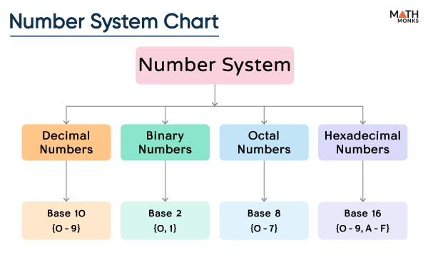

[Home](README.md) | [Next Page](BinaryToDecminal.md)

# Binary Basics

**Definition:** a numberical system tht uses only two digits (0, 1), to represent values, often in a computing system.

### Number Systems
There are four common types of number systems used:
- Base-2: Binary is a base-2 number system because it only uses the numbers 0 and 1.
- Base-8: Known as the octal number system and uses numbers 0-7.
- Base-10: Known as the decminal number system and uses numbers 0-9
- Base-16: Known as the hexadecimal number systems and uses number 0-9 and letters A-F.

### Why is Binary Important?
Binary plays a critical role in computing because it is the basis of binary digits, or bits, which are the most basic unit of information in a computer. Binary allows computers to efficiently store and manipulate data and it can represent various different types of digital data including text, numbers, images, and sound. Binary makes it possible for computers to communicate, perform calculations, and store information. 

When using binary, each digit can either be a 1 or a 0. Counting binary number is similar to counting decimal number where when one digit s its maximum value, another digit is added to the the left side. 

### Applications of Binary
Binary is used in many applications such as:
- Computer Processors: use binary to perform arithmetic and logical operations
- File Compression & Decompression: compression algorithms use binary code to represent the data in a more compact form to reduce the amount of storage space required
- Cryptography: binary is used in cryptography for encryption, decryption, and authentication
- Digital Audio & Video Processing: audio and video files are encoded as streams of binary data
- Machine Learning & AI: machine learning and artifical intelligence models like neural networks use binary
