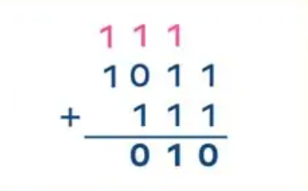
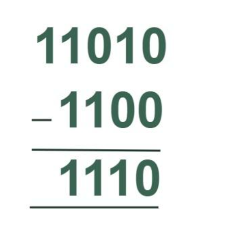
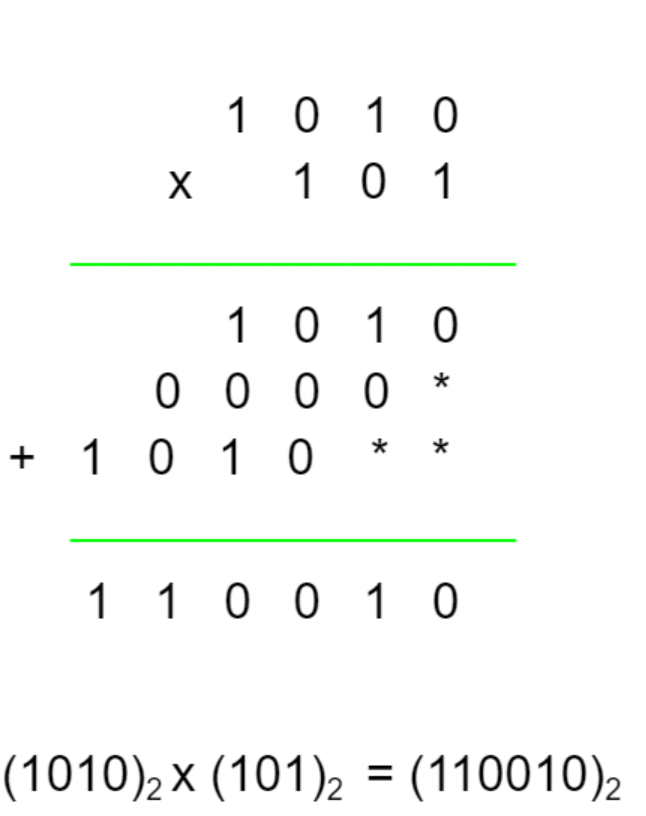
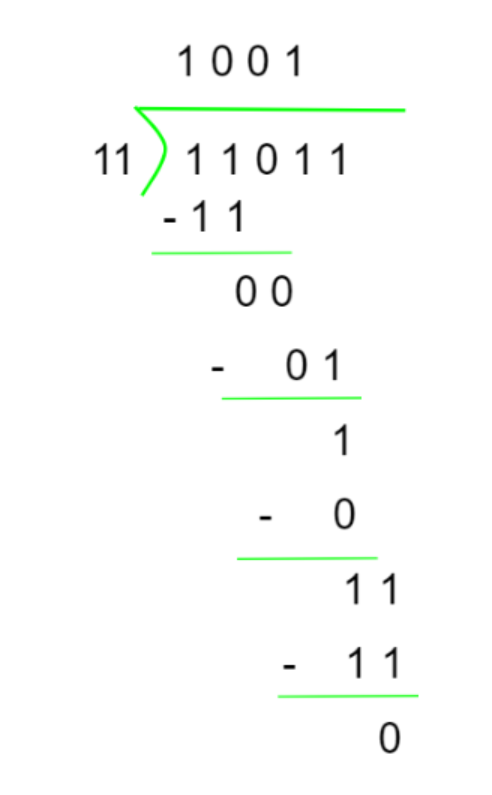

[Home](README.md) | [Back](BinaryToOctal.md)

# Binary Math

There are various operations that can be performed using binary numbers, including addition, subtraction, multiplication, and division.

## Binary Addition
When adding binary values, use the following table to determine the solution:

| First Number | Second Number | Addition | Carry |
| ----- | ----- | ----- | ----- |
| 0 | 0 | 0 | 0 |
| 0 | 1 | 1 | 0 |
| 1 | 0 | 1 | 0 |
| 1 | 1 | 0 | 1 |

Instructions:
1. Line up the numbers like in normal addition
2. Add from right to left
3. Use the table above to complete the problem
4. If you get 1 + 1 + 1, write 1 and carry 1 to the next column

### Example:

## Binary Subtraction
Use the table below when doing a binary subtraction problem:

| First Number | Second Number | Subtraction | Borrow |
| --- | --- | --- | --- |
| 0 | 0 | 0 | 0 |
| 1 | 0 | 1 | 0 |
| 0 | 1 | 1 | 1 |
| 1 | 1 | 0 | 0 |

Instructions:
1. Line up the numbers
2. Subtract from right to left
3. If the subtraction is 0 - 1, borrow from the next 1

### Example:

## Binary Multiplication
Use the table below when doing a binary multiplication problem:

| First Number | Second Number | Result |
| --- | --- | --- |
| 0 | 0 | 0 |
| 0 | 1 | 0 |
| 1 | 0 | 0 |
| 1 | 1 | 1 |

Instructions:
1. Line up the numbers
2. Multiply the right digit on the first number with all of the digits in the second number
3. Add 0s to shift the next row to the left
4. Repeat the process for all of the digits in the first number
5. Add the results of multiplying each digit to get the final result

### Example:

## Binary Division
Use the table below when completing a binary division problem:

| First Number | Second Number | Result |
| --- | --- | --- |
| 0 | 1 | 0 |
| 1 | 1 | 1 |

Instructions:
1. Compare the left bits of the dividend to the divisor
2. Write 1 if the divisor fits, or 0 if it does not
3. Multiply the divisor by the quotient bit and write the result under the selected dividend bits
4. Subtract and bring fown the next bit
5. Repeat until all bits have been divided

### Example:

