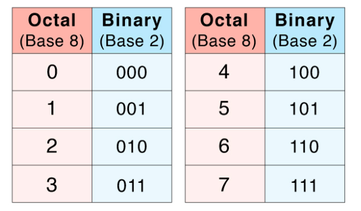

[Home](README.md) | [Back](BinaryToHex.md) | [Next](BinaryMath.md)

## Binary to Octal Conversion
To convert from binary to octal numbers, group the binary number into 3-bit sections. Then convert the binary groups into octal values. 

Instructions:
1. Starting from the right side, separate the digits into groups of three
2. If the last group has less than 3 digits, add 0s to the front to get a group of 3
3. Convert each group into its octal value using, O = (n * 22) + (n * 21) + (n * 20)
4. Put the numbers together to get the octal value

### Examples:

- Binary: 11101011
- Split: 011 101 011
- 011 = (0 * 22) + (1 * 21) + (1 * 20) = 3
- 101 = (1 * 22) + (0 * 21) + (1 * 20) = 5
- 011 = (0 * 22) + (1 * 21) + (1 * 20) = 3
- Octal Value: 353
--- 
- Binary: 11101100101001
- Split: 011 101 100 101 001
- 011 = (0 * 22) + (1 * 21) + (1 * 20) = 3
- 101 = (1 * 22) + (0 * 21) + (1 * 20) = 5
- 100 = (1 * 22) + (0 * 21) + (0 * 20) = 4
- 101 = (1 * 22) + (0 * 21) + (1 * 20) = 5
- 001 = (0 * 22) + (0 * 21) + (1 * 20) = 1
- Octal Value: 35451

## Octal to Binary Conversion

Instructions:
1. Separate each octal number
2. Convert each digit into  3-bit binary number using the table below
3. Combine the groups to get the binary value

### Examples:

- Octal: 627
- 6 = 4 + 2 + 0 = 110
- 2 = 0 + 2 + 1 = 010
- 7 = 4 + 2 + 1 = 111
- Binary Value = 110010111
--- 
- Octal: 1453
- 1 = 0 + 0 + 1 = 001
- 4 = 4 + 0 + 0 = 100
- 5 = 4 + 0 + 1 = 101
- 3 = 0 + 2 + 1 = 011
- Binary Value = 001100101011